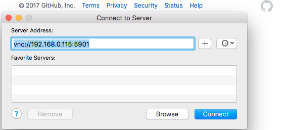

# Display your Raspberry Pi's Desktop
VNC(Virtual Network Computing).**VNC** is a standard, widely supported way of securely presenting a GUI remotely over a network connection.You need a suitable server running on the machine that will be sharing its desktop,and a client app to present that desktop on the computer you're accessting the remote machine from.The client relays your mouse and keyboard input back to the remote computer.

The Raspberry Pi Foundation recommends a specific VNC server, tightvncserver, written by TightVNC Software.
```
sudo apt-get install tightvncserver
tightvncserver # When the software has downloaded and installed, it's ready to run
```

You will be asked to set up an remote access control password and to enter it a second time, as verification.You'll also be asked if you'd like to enter a password for view-only access.This is optional; I just entered 'n' for no.

Apple has long provided Apple Remote Desktop(ARD), a tool for remotely accessing Mac desktop.Over the years, it has gained support for a variety of remote access technologies,including VNC.

**ARD** doesn't live in the Applications folder - It's actually buried deep in the System folder - but it can be launched via finder.Just hit **Command-K** to invoke the standard Mac 'Connect to Server' dialog.Here,enter
```
vnc://pi.local:5901
```


